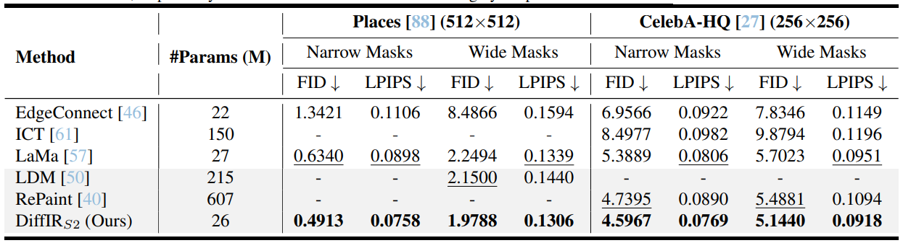
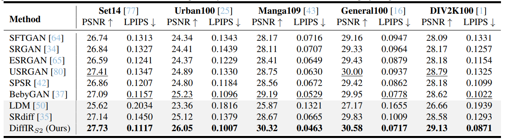
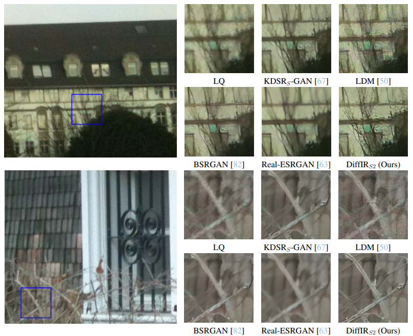

# DiffIR: Efficient diffusion model for image restoration (ICCV2023)

[Paper](https://arxiv.org/pdf/2303.09472.pdf) | [Project Page](https://github.com/Zj-BinXia/DiffIR) | [pretrained models](https://drive.google.com/drive/folders/10miVILiopE414GyaSZM3EFAZITeY9q0p?usp=sharing)

#### News
- **August 31, 2023:** For real-world SR tasks, we released the 2x SR pretrained models [RealworldSR-DiffIRS2-GANx2](https://drive.google.com/file/d/1y8cnsoifY1z06r5bBwPby5bDxbxItE_j/view?usp=drive_link) and [training files](DiffIR-RealSR/options/train_DiffIRS2_GAN_x2.yml). 
- **August 28, 2023:** For real-world SR tasks, we released the pretrained models [RealworldSR-DiffIRS2-GANV2](https://drive.google.com/drive/folders/1H4DU-9fB15fSz-OFko00HlWYbNSqmAKq?usp=sharing) and [training files](DiffIR-RealSR/options/train_DiffIRS2_GAN_x4_V2.yml) that are more focused on perception rather than the distortion， which can be used to super-resolve AIGC generated images. 
- **July 20, 2023:** Training&Testing codes and pre-trained models are released!

> **Abstract:** *Diffusion model (DM) has achieved SOTA performance by modeling the image synthesis process into a sequential application of a denoising network. However, different from image synthesis, image restoration (IR) has a strong constraint to generate results in accordance with ground-truth. Thus, for IR, traditional DMs running massive iterations on a large model to estimate whole images or feature maps is inefficient. To address this issue, we propose an efficient DM for IR (DiffIR), which consists of a compact IR prior extraction network (CPEN), dynamic IR transformer (DIRformer), and denoising network. Specifically, DiffIR has two training stages: pretraining and training DM. In pretraining, we input ground-truth images into CPEN$_{S1}$ to capture a compact IR prior representation (IPR) to guide DIRformer. In the second stage, we train the DM to directly estimate the same IRP as pretrained CPEN$_{S1}$ only using LQ images. We observe that since the IPR is only a compact vector,  DiffIR can use fewer iterations than traditional DM to obtain accurate estimations and generate more stable and realistic results. Since the iterations are few, our DiffIR can adopt a joint optimization of CPEN$_{S2}$, DIRformer, and denoising network, which can further reduce the estimation error influence. We conduct extensive experiments on several IR tasks and achieve SOTA performance while consuming less computational costs.* 
>
> 

> 
> 

---

## Installation

For inpainting, see [pip.sh](DiffIR-inpainting/pip.sh) for the installation of dependencies required to run DiffIR.

For GAN based single-image super-resolution, see [pip.sh](DiffIR-SRGAN/pip.sh) for the installation of dependencies required to run DiffIR.

For real-world super-resolution, see [pip.sh](DiffIR-RealSR/pip.sh) for the installation of dependencies required to run DiffIR.

For motion deblurring, see [pip.sh](DiffIR-demotionblur/pip.sh) for the installation of dependencies required to run DiffIR.

## Training and Evaluation

Training and Testing instructions for Inpainting, GAN based single-image super-resolution, real-world super-resolution, and motion deblurring are provided in their respective directories. Here is a summary table containing hyperlinks for easy navigation:

<table>
  <tr>
    <th align="left">Task</th>
    <th align="center">Training Instructions</th>
    <th align="center">Testing Instructions</th>
    <th align="center">DiffIR's Pretrained Models</th>
  </tr>
  <tr>
    <td align="left">Inpainting</td>
    <td align="center"><a href="DiffIR-inpainting/README.md#training">Link</a></td>
    <td align="center"><a href="DiffIR-inpainting/README.md#evaluation">Link</a></td>
    <td align="center"><a href="https://drive.google.com/drive/folders/1RQXRWMqVaAsyyQt8T-3KtpS68ef8dh90?usp=drive_link">Download</a></td>
  </tr>
  <tr>
    <td>GAN based single-image super-resolution</td>
    <td align="center"><a href="DiffIR-SRGAN/README.md#training">Link</a></td>
    <td align="center"><a href="DiffIR-SRGAN/README.md#evaluation">Link</a></td>
    <td align="center"><a href="https://drive.google.com/drive/folders/1Mmhz6Sx9tz-n3QJAd6w-UlxdugTEH2fV?usp=drive_link">Download</a></td>
  </tr>
  <tr>
    <td>Real-world super-resolution</td>
    <td align="center"><a href="DiffIR-RealSR/README.md#training">Link</a></td>
    <td align="center"><a href="DiffIR-RealSR/README.md#evaluation">Link</a></td>
    <td align="center"><a href="https://drive.google.com/drive/folders/1G3Ep0xd-uBpIXGZFdWzH1uVCOpJaqkOF?usp=drive_link">Download</a></td>
  </tr>
  <tr>
    <td>Motion deblurring</td>
    <td align="center"><a href="DiffIR-demotionblur/README.md#training">Link</a></td>
    <td align="center"><a href="DiffIR-demotionblur/README.md#evaluation">Link</a></td>
    <td align="center"><a href="https://drive.google.com/drive/folders/1JWYaP9VVPX_Mh2w1Vezn74hck-oWSyMh?usp=drive_link">Download</a></td>
  </tr>
</table>

## Results
Experiments are performed for different image processing tasks including, inpainting, GAN-based single-image super-resolution, real-world super-resolution, and motion deblurring. 

<strong>Inpainting</strong> (click to expand) 

 
 

<strong>GAN-based single-image super-resolution</strong> (click to expand) 

  

<strong>Real-world super-resolution</strong> (click to expand) 

  

<strong>Motion deblurring</strong> (click to expand) 

  

## Citation
If you use DiffIR, please consider citing:

    @article{xia2023diffir,
      title={Diffir: Efficient diffusion model for image restoration},
      author={Xia, Bin and Zhang, Yulun and Wang, Shiyin and Wang, Yitong and Wu, Xinglong and Tian, Yapeng and Yang, Wenming and Van Gool, Luc},
      journal={ICCV},
      year={2023}
    }

## Contact
Should you have any question, please contact zjbinxia@gmail.com

