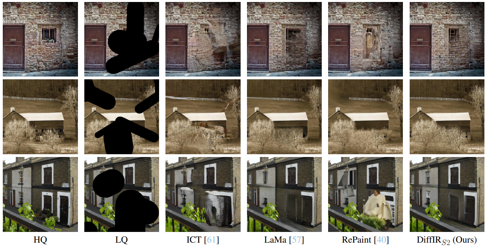
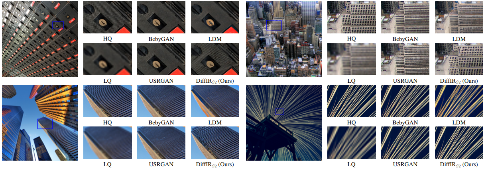
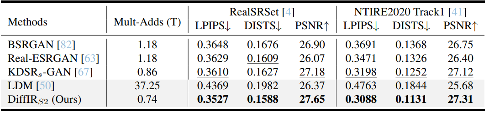

# DiffIR: Efficient diffusion model for image restoration (ICCV2023)

[Paper](https://arxiv.org/pdf/2303.09472.pdf) | [Project Page](https://github.com/Zj-BinXia/DiffIR) | [pretrained models](https://drive.google.com/drive/folders/10miVILiopE414GyaSZM3EFAZITeY9q0p?usp=sharing)

---

> **Abstract:** *Diffusion model (DM) has achieved SOTA performance by modeling the image synthesis process into a sequential application of a denoising network. However, different from image synthesis, image restoration (IR) has a strong constraint to generate results in accordance with ground-truth. Thus, for IR, traditional DMs running massive iterations on a large model to estimate whole images or feature maps is inefficient. To address this issue, we propose an efficient DM for IR (DiffIR), which consists of a compact IR prior extraction network (CPEN), dynamic IR transformer (DIRformer), and denoising network. Specifically, DiffIR has two training stages: pretraining and training DM. In pretraining, we input ground-truth images into CPEN$_{S1}$ to capture a compact IR prior representation (IPR) to guide DIRformer. In the second stage, we train the DM to directly estimate the same IRP as pretrained CPEN$_{S1}$ only using LQ images. We observe that since the IPR is only a compact vector,  DiffIR can use fewer iterations than traditional DM to obtain accurate estimations and generate more stable and realistic results. Since the iterations are few, our DiffIR can adopt a joint optimization of CPEN$_{S2}$, DIRformer, and denoising network, which can further reduce the estimation error influence. We conduct extensive experiments on several IR tasks and achieve SOTA performance while consuming less computational costs.* 
>
> <p align="center">
> 
> </p>

---

## Installation

See [INSTALL.md](INSTALL.md) for the installation of dependencies required to run Restormer.

## Demo

To test the pre-trained Restormer models of [Deraining](https://drive.google.com/drive/folders/1ZEDDEVW0UgkpWi-N4Lj_JUoVChGXCu_u), [Motion Deblurring](https://drive.google.com/drive/folders/1czMyfRTQDX3j3ErByYeZ1PM4GVLbJeGK), [Defocus Deblurring](https://drive.google.com/drive/folders/1bRBG8DG_72AGA6-eRePvChlT5ZO4cwJ4?usp=sharing), and [Denoising](https://drive.google.com/drive/folders/1Qwsjyny54RZWa7zC4Apg7exixLBo4uF0) on your own images, you can either use Google Colab [](https://colab.research.google.com/drive/1C2818h7KnjNv4R1sabe14_AYL7lWhmu6?usp=sharing), or command line as following
```
python demo.py --task Task_Name --input_dir path_to_images --result_dir save_images_here
```
Example usage to perform Defocus Deblurring on a directory of images:
```
python demo.py --task Single_Image_Defocus_Deblurring --input_dir './demo/degraded/' --result_dir './demo/restored/'
```
Example usage to perform Defocus Deblurring on an image directly:
```
python demo.py --task Single_Image_Defocus_Deblurring --input_dir './demo/degraded/portrait.jpg' --result_dir './demo/restored/'
```

## Training and Evaluation

Training and Testing instructions for Deraining, Motion Deblurring, Defocus Deblurring, and Denoising are provided in their respective directories. Here is a summary table containing hyperlinks for easy navigation:

<table>
  <tr>
    <th align="left">Task</th>
    <th align="center">Training Instructions</th>
    <th align="center">Testing Instructions</th>
    <th align="center">DiffIR's Visual Results</th>
  </tr>
  <tr>
    <td align="left">Inpainting</td>
    <td align="center"><a href="Deraining/README.md#training">Link</a></td>
    <td align="center"><a href="Deraining/README.md#evaluation">Link</a></td>
    <td align="center"><a href="https://drive.google.com/drive/folders/1HcLc6v03q_sP_lRPcl7_NJmlB9f48TWU?usp=sharing">Download</a></td>
  </tr>
  <tr>
    <td>GAN based single-image super-resolution</td>
    <td align="center"><a href="Motion_Deblurring/README.md#training">Link</a></td>
    <td align="center"><a href="Motion_Deblurring/README.md#evaluation">Link</a></td>
    <td align="center"><a href="https://drive.google.com/drive/folders/1qla3HEOuGapv1hqBwXEMi2USFPB2qmx_?usp=sharing">Download</a></td>
  </tr>
  <tr>
    <td>Real-world super-resolution</td>
    <td align="center"><a href="Defocus_Deblurring/README.md#training">Link</a></td>
    <td align="center"><a href="Defocus_Deblurring/README.md#evaluation">Link</a></td>
    <td align="center"><a href="https://drive.google.com/drive/folders/1V_pLc9CZFe4vN7c4SxtXsXKi2FnLUt98?usp=sharing">Download</a></td>
  </tr>
  <tr>
    <td>Motion deblurring</td>
    <td align="center"><a href="Denoising/README.md#training">Link</a></td>
    <td align="center"><a href="Denoising/README.md#evaluation">Link</a></td>
    <td align="center"><a href="https://drive.google.com/drive/folders/1rEAHUBkA9uCe9Q0AzI5zkYxePSgxYDEG?usp=sharing">Download</a></td>
  </tr>
</table>

## Results
Experiments are performed for different image processing tasks including, inpainting, GAN-based single-image super-resolution, real-world super-resolution, and motion deblurring. 

<details>
<summary><strong>Inpainting</strong> (click to expand) </summary>

 
</details>

<details>
<summary><strong>GAN-based single-image super-resolution</strong> (click to expand) </summary>

<details>

<details>
<summary><strong>Real-world super-resolution</strong> (click to expand) </summary>

</details>

<details>
<summary><strong>Motion deblurring</strong> (click to expand) </summary>

</details>

## Citation
If you use DiffIR, please consider citing:

@article{xia2023diffir,
  title={Diffir: Efficient diffusion model for image restoration},
  author={Xia, Bin and Zhang, Yulun and Wang, Shiyin and Wang, Yitong and Wu, Xinglong and Tian, Yapeng and Yang, Wenming and Van Gool, Luc},
  journal={ICCV},
  year={2023}
}


## Contact
Should you have any question, please contact zjbinxia@gmail.com


